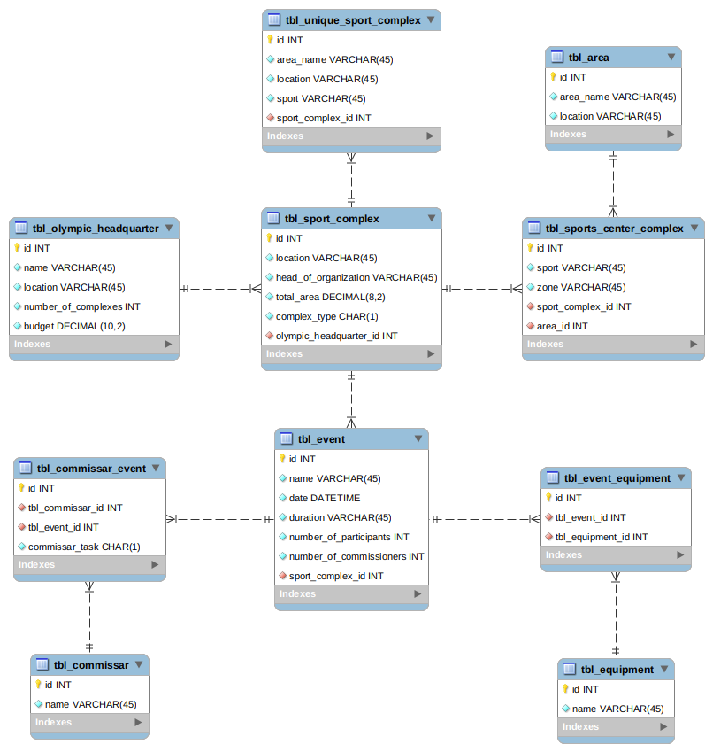

# OLYMPIC GAMES PROJECT

El presente proyecto tiene implementado el Back-end y Front-end para Administrar los Juegos Olímpicos el que fue solicitado como parte de un desafió como Fullstack Developer.

## BACKEND
Toda la implementación del Back-end se encuentra ubicado en el directorio `./service` y es un proyecto empleando el [Framework Laravel 7.0](https://laravel.com/docs/7.x) con PHP 7.2.5. Para obtener instrucciones de como ejecutar el back-end del proyecto por favor dirigirse a `./service/README.md`.

- [Ver intrucciones](./service/README.md)
- [Colección en PostMan de los EndPoint creados](https://documenter.getpostman.com/view/4566921/SzzhdxzC?version=latest)

## FRONTEND
Toda la implementación del Front-end se encuentra ubicado bajo el directorio `./webapp` y es un proyecto creado usando Node JS, [Vue JS](https://vuejs.org/), Typescript y [Quasar Framework](https://quasar.dev/start/pick-quasar-flavour). Para obtener instrucciones de como instalar y ejecutar el front-end del proyecto por favor dirigirse a `./webapp/README.md`.

- [Ver intrucciones](./webapp/README.md)

## DOCKER
Usar Docker en nuestro proyecto me ha facilitado levantar todo el ambiente de desarrollo de manera practica y sencilla, es por ello que en el directorio `./docker` se encuentran las imagenes de nuestro `Apache Server` y `MySQL` que son necesarios para levantar nuestro servicio. Para obtener mas detalles de como levantar estos contenedores por favor dirigirse a `./docker/README.md`.

- [Ver intrucciones](./docker/README.md)

## MODELO DE BASE DE DATOS
